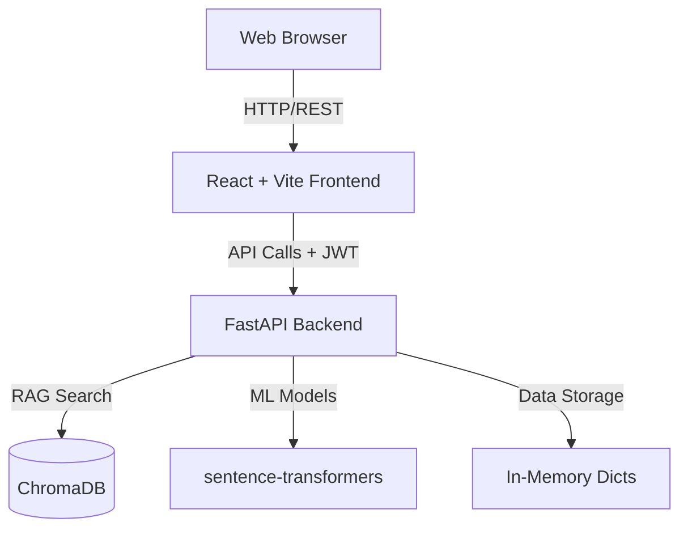

# QUANTUM-ARES

## 1. Project Overview

**QUANTUM-ARES** is a cybersecurity infrastructure validation platform that analyzes infrastructure architecture before deployment. It identifies security vulnerabilities such as attack paths, weak encryption, supply chain risks, and misconfigured trust relationships.

The platform converts infrastructure configurations into a graph representation and generates a Security Index score along with a verifiable security report.

## 2. Features
- Pre-deployment infrastructure analysis
- Automated vulnerability identification (attack paths, encryption, supply chains)
- Architecture graph generation
- Security Index scoring
- Verifiable security reporting

## 3. System Architecture

The application is built on a modern decoupled architecture:
- A responsive React frontend served via Vite
- A fast asynchronous API powered by FastAPI
- AI-assisted analysis using sentence-transformers and chromadb
- Stateless scaling with in-memory design for MVP



## 4. Technology Stack

### Frontend
- **Framework**: React 18
- **Build Tool**: Vite
- **Styling**: TailwindCSS

### Backend
- **Framework**: FastAPI
- **Server**: Uvicorn
- **Authentication**: JWT (`python-jose`)
- **Password Hashing**: Argon2 (`argon2-cffi` / `passlib`)

### Database (MVP)
- **Current State**: In-memory dictionaries (`MOCK_USERS` and `SESSIONS_CACHE`)
- **Note**: No external database is required for MVP.

### AI Dependencies
- `sentence-transformers`
- `chromadb`

### WebSockets
- Redis Pub/Sub configured in `websocket.py` (Not currently wired in main runtime).

### Deployment
- Render native web services (No Docker required).

---

## 5. Local Development Setup

To run QUANTUM-ARES locally, you will need terminal access with Python and Node.js installed.

## 6. Running the Backend

**Step 1:** Create and activate a Python virtual environment.
```bash
python -m venv venv

# Activate on Windows:
venv\Scripts\activate

# Activate on Linux/macOS:
source venv/bin/activate
```

**Step 2:** Install backend dependencies.
```bash
pip install -r requirements.txt
```

**Step 3:** Run the backend server.
```bash
uvicorn saas_platform.backend.main:app --host 0.0.0.0 --port 8000 --reload
```

- The backend should now run at: http://localhost:8000
- **Swagger docs**: http://localhost:8000/docs

---

## 7. Running the Frontend

**Step 1:** Navigate to the frontend directory.
*(Note: In the current repository structure, the frontend code is located at the root in the `src` directory, so running it from the root directory works.)*
```bash
cd frontend  # or run from root depending on folder layout
```

**Step 2:** Install dependencies.
```bash
npm install
```

**Step 3:** Run the development server.
```bash
npm run dev
```

- The frontend should now run at: http://localhost:5173

---

## 8. Environment Variables

Create a `.env` file in your backend and frontend contexts. Ensure paths match where your application loads them.

### Backend (`.env`)
```ini
PYTHON_VERSION=3.11
SECRET_KEY=your-secure-secret-key
CORS_ORIGINS=http://localhost:5173
```

### Frontend (`.env`)
```ini
NODE_VERSION=20
VITE_API_URL=http://localhost:8000/api
```

---

## 9. Render Deployment Guide

QUANTUM-ARES is configured to deploy as two native web services on Render.

### Render Blueprint (Recommended)
Deployment can be done instantly using the `render.yaml` with **Render Blueprints**.

1. Connect your GitHub repository to Render.
2. Select **"New Blueprint Instance"**.
3. Render automatically provisions and deploys both services using the blueprint.

### Manual Setup

If you prefer to deploy manually, configure the two services as follows:

#### Backend Service
- **Service Name**: `quantum-ares-backend`
- **Region**: Ohio
- **Plan**: Free
- **Build Command**:
  ```bash
  pip install -r requirements.txt
  ```
- **Start Command**:
  ```bash
  uvicorn saas_platform.backend.main:app --host 0.0.0.0 --port $PORT
  ```
- **Environment Variables**:
  - `PYTHON_VERSION` = `3.11`
  - `SECRET_KEY` = *(Click Generate secure value in Render)*
  - `CORS_ORIGINS` = `https://your-frontend-url.onrender.com`

#### Frontend Service
- **Service Name**: `quantum-ares-frontend`
- **Region**: Ohio
- **Plan**: Free
- **Build Command**:
  ```bash
  npm install && npm run build
  ```
- **Start Command**:
  ```bash
  npx serve -s dist -l $PORT
  ```
- **Environment Variables**:
  - `NODE_VERSION` = `20`
  - `VITE_API_URL` = `https://your-backend-url.onrender.com/api`

---

## 10. Troubleshooting

### Out of Memory Error
- **Cause**: The `sentence-transformers` package downloads heavy PyTorch dependencies.
- **Fix**: Upgrade your Render plan temporarily, or remove `sentence-transformers` and `chromadb` from your `requirements.txt` if you don't need AI.

### Frontend `react/jsx-runtime` Error
- **Cause**: React might be incorrectly set as a `peerDependency`.
- **Fix**: Ensure React is listed clearly in `dependencies` inside `package.json`.

### Backend `jwt module` Error
- **Cause**: A conflict between `PyJWT` and `python-jose` packages.
- **Fix**: Use `python-jose` imports consistently (`from jose import jwt` instead of `import jwt`).

### CORS Error
- **Cause**: Incorrect `CORS_ORIGINS` value linking the frontend and backend.
- **Fix**: Set the `CORS_ORIGINS` environment variable exactly to the frontend URL (without trailing slashes).

### Data Resets After Reload
- **Cause**: The system uses in-memory storage for MVPs (`MOCK_USERS`, `SESSIONS_CACHE`).
- **Fix**: This is expected for the MVP. Implement the PostgreSQL database for data persistence.

---

## 11. Future Improvements
- Wire the PostgreSQL schema into the main runtime for data persistence.
- Implement and connect the Redis Pub/Sub WebSocket handlers for real-time analysis streaming.
- Integrate active containerized scanning or external vulnerability database syncs.
- Containerize the application stack using Docker.
